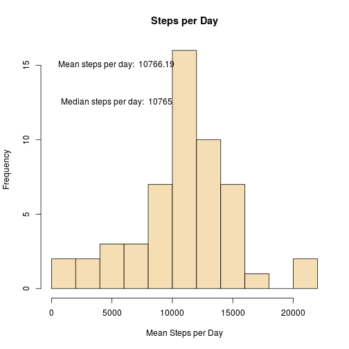
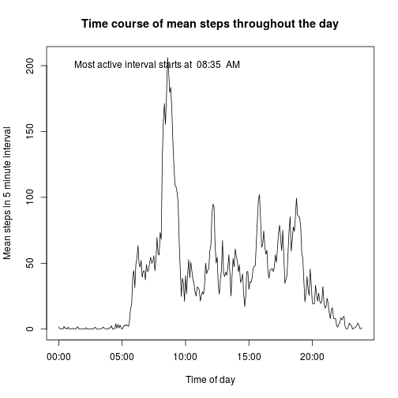
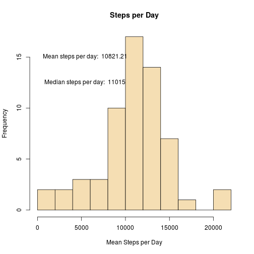
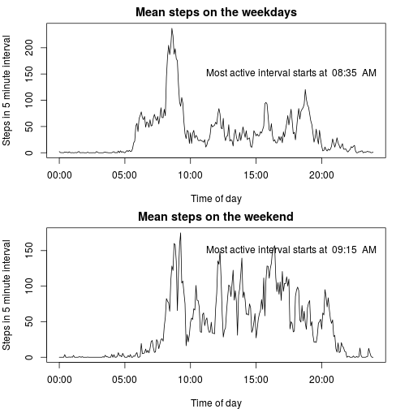

##Introduction
###title: "Reproducible Research Project One"
###author: "Louis Fernandes"
###date: "January 7, 2016"
###output: html_document

This project will analyze two months of personal motion data provided as part of the Coursera "Reproducible Research" course offered January 2016.

##Initial exploration

We begin by loading in the data set. I will convert the time intervals to something a little more friendly here.

```r
data <- read.csv('activity.csv')
times <- sprintf("%04d", unique(data$interval))
times <- strptime(times, format = "%H%M")
```

For our first exploration, we will look at the number of steps taken per day. I will generate a histogram of the total number of steps per day, and will display the mean and median of the distribution on that figure.


```r
stepsPerDay <- split(data$steps, data$date)
totalStepsPerDay <- lapply(stepsPerDay, sum)
meanTotalSteps <- mean(as.numeric(totalStepsPerDay), na.rm=TRUE)
medianTotalSteps <- median(as.numeric(totalStepsPerDay), na.rm=TRUE)
hist(as.numeric(totalStepsPerDay), col='wheat', breaks='FD', 
     xlab='Mean Steps per Day', main='Steps per Day')
text(meanTotalSteps/2, 15, paste('Mean steps per day: ',
                                 round(meanTotalSteps,2)))
text(meanTotalSteps/2, 12.5, paste('Median steps per day: ',
                                 round(medianTotalSteps,2)))
```



Let's next investigate the mean activity over 5 minute intervals. 

```r
stepsPerInterval <- split(data$steps, data$interval)
meanPerInterval <- lapply(stepsPerInterval, mean, na.rm=TRUE)
plot(times, meanPerInterval, main = "Time course of mean steps throughout the day",
     type='l', xlab = 'Time of day', ylab = 'Mean steps in 5 minute interval')
maximumInterval <- times[which.max(as.numeric(meanPerInterval))]
text(times[10], 200, paste('Most active interval starts at ', format(maximumInterval, "%H:%M"), " AM"), pos=4)
```



##Filling in missing values

As the assignment points out, and as we noticed previously (as we used `na.rm = TRUE`), this data set has missing values. We will now deal with those missing sections.


```r
missingRows <- sum(is.na(data[,1]))
totalRows <- nrow(data)
```
We have 2304 missing values, out of a total of 17568. We must worry about introducing biases into our analysis due to lack of data. For example, if the measurements were never taken on a weekend, we would expect to see a bias towards a workday pattern, which is not necessarily the same as a weekend pattern. One strategy to mitigate this effect is to try to fill in missing values of the data using the knowledge we already have. This could reinforce some biases while reducing others, so ideally a variety of strategies would be employed and the effects of each compared to try to determine an optimal strategy for a given data set. 

Here, we will fill in values with the mean of that interval from that particular day of the week. So, if a value for 5AM on a Saturday is missing, we will fill it in with the average of all of the accounted-for 5AM Saturday intervals. One case we may encounter is that this procedure will not fill all the voids; we will inspect for that possibility and fill in with averages for either a weekday or a weekend as appropriate if this occurs.


```r
data$day <- weekdays(as.Date(data$date))
dataPerDayPerInterval <- split(data$steps, list(data$day, data$interval))
meanPerDayPerInterval <- lapply(dataPerDayPerInterval, mean, na.rm=TRUE)
data$dayTime <- paste(as.character(data[,"day"]), '.', 
                   as.character(data[,"interval"]), sep="")
mD <- data
mD$steps <- as.numeric(ifelse(is.na(mD$steps), meanPerDayPerInterval[mD$dayTime],mD$steps))
```

Let's examine the effect of filling in missing data on the statistics of the total number of steps.

```r
stepsPerDay <- split(mD$steps, mD$date)
totalStepsPerDayFilled <- lapply(stepsPerDay, sum)
meanTotalStepsFilled <- mean(as.numeric(totalStepsPerDayFilled), na.rm=TRUE)
medianTotalStepsFilled <- median(as.numeric(totalStepsPerDayFilled), na.rm=TRUE)
hist(as.numeric(totalStepsPerDayFilled), col='wheat', breaks='FD', 
     xlab='Mean Steps per Day', main='Steps per Day')
text(meanTotalStepsFilled/2, 15, paste('Mean steps per day: ',
                                 round(meanTotalStepsFilled,2)))
text(meanTotalStepsFilled/2, 12.5, paste('Median steps per day: ',
                                 round(medianTotalStepsFilled,2)))
```



We see that using the mean of a particular day and time interval as a replacement for NA values in steps results in 1.01% more steps per day on average, a slight increase, while the median number of steps per day increases by 1.02%. 

##Weekend vs weekday activity

We will now investigate differences in activity between the week and the weekend. We will add a factor variable for "weekday" or "weekend" to our filled data set. We will then plot the time series of activity based on this factor. 

```r
daysOfWeek <- c("Monday", "Tuesday", "Wednesday", "Thursday", "Friday")
mD$weekday <- factor(mD$day %in% daysOfWeek,levels = c(TRUE, FALSE), 
                     labels=c("Weekday", "Weekend"))
stepsPerTypePerInterval <- split(mD, mD$weekday)
stepsPerWeekday <- stepsPerTypePerInterval$Weekday
stepsPerWeekday<- split(stepsPerWeekday$steps, stepsPerWeekday$interval)
meanStepsPerWeekday <- lapply(stepsPerWeekday, mean)
maximumWeekdayInterval <- times[which.max(as.numeric(meanStepsPerWeekday))]

stepsPerWeekend <- stepsPerTypePerInterval$Weekend
stepsPerWeekend<- split(stepsPerWeekend$steps, stepsPerWeekend$interval)
meanStepsPerWeekend <- lapply(stepsPerWeekend, mean)
maximumWeekendInterval <- times[which.max(as.numeric(meanStepsPerWeekend))]

par(mfrow=c(2,1), mar=c(4, 4, 2, 2))
plot(times, meanStepsPerWeekday, type='l', xlab="Time of day", 
     ylab="Steps in 5 minute interval", main = 'Mean steps on the weekdays')
text(times[130], 150, paste('Most active interval starts at ', 
                           format(maximumWeekdayInterval, "%H:%M"), " AM"), pos=4)

plot(times, meanStepsPerWeekend, type='l', xlab="Time of day",
     ylab="Steps in 5 minute interval", main = "Mean steps on the weekend")
text(times[130], 150, paste('Most active interval starts at ', 
                           format(maximumWeekendInterval, "%H:%M"), " AM"), pos=4)
```


